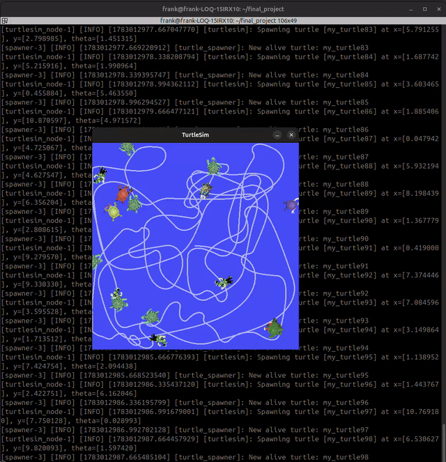

# ROS 2 Autonomous Target Tracking

A ROS 2 (C++) project implementing **autonomous target tracking and pursuit** using a multi-node architecture. A controlled turtle autonomously detects, selects, and navigates toward dynamic targets in real time, catching them upon arrival and immediately acquiring the next target.

## Demo



*(10s preview — [watch the full demo video](media/demo.webm))*

## Project Overview

The system consists of a **controlled agent** (the main turtle) that continuously tracks and catches randomly spawned targets on the `turtlesim` grid. When a target is caught, it is removed from the environment and the agent immediately acquires the next target. This loop runs indefinitely, demonstrating closed-loop autonomous behavior.

Key behaviors demonstrated:
- Real-time target acquisition and pursuit
- Dynamic target selection (closest target first, or oldest-first/FIFO)
- Multi-node coordination via topics and services
- Closed-loop control using a proportional (P) controller

## System Architecture

Two nodes communicate via topics and services with the `turtlesim` simulator:

```
turtle_spawner → /alive_turtles → turtle_controller → /turtle1/cmd_vel → turtlesim_node
                                        ↑                                      ↓
                              /catch_turtle (srv)               /turtle1/pose (topic)
                                        ↓
                                turtle_spawner → /kill (turtlesim srv)
```

### Nodes

| Node (executable) | ROS node name | Package | Role |
|---|---|---|---|
| `turtlesim_node` | `turtlesim` | `turtlesim` | 2D simulation environment |
| `spawner` | `turtle_spawner` | `turtlesim_project_cpp` | Spawns targets at random positions, tracks active targets, removes caught ones |
| `controller` | `turtle_controller` | `turtlesim_project_cpp` | Drives the main turtle, selects and pursues targets using a P controller |

### Topics

| Topic | Type | Description |
|---|---|---|
| `/alive_turtles` | `my_robot_interfaces/TurtleArray` | List of currently active targets with coordinates |
| `/turtle1/pose` | `turtlesim/Pose` | Current pose of the controlled agent |
| `/turtle1/cmd_vel` | `geometry_msgs/Twist` | Velocity commands for the agent |

### Services

| Service | Type | Description |
|---|---|---|
| `/spawn` | `turtlesim/Spawn` | Spawns a new target in the environment |
| `/kill` | `turtlesim/Kill` | Removes a caught target from the environment |
| `/catch_turtle` | `my_robot_interfaces/CatchTurtle` | Called by the controller when a target is reached |

### Custom Interfaces

```
Turtle.msg
  string name
  float64 x
  float64 y
  float64 theta

TurtleArray.msg
  Turtle[] turtles

CatchTurtle.srv
  string name
  ---
  bool success
```

## Control Algorithm

`turtle_controller` implements a simplified **Proportional (P) Controller**:

- Selects a target from `/alive_turtles` — closest first by default, or oldest-first (FIFO) if `catch_closest_turtle_first` is set to false
- Linear velocity scales proportionally with distance to the target (gain = 2)
- Angular velocity scales proportionally with heading error (gain = 6), normalized to `[-π, π]`
- Target is considered caught when distance < 0.5 units, at which point `/catch_turtle` is called and the agent immediately re-targets
- Runs at 100 Hz (10 ms control loop) for smooth pursuit

## Parameters

### `turtle_spawner` (executable: `spawner`)
| Parameter | Default | Description |
|---|---|---|
| `spawn_frequency` | `0.5` | Target spawn rate (targets per second) |
| `turtle_name_prefix` | `turtle` | Prefix for spawned target names |

### `turtle_controller` (executable: `controller`)
| Parameter | Default | Description |
|---|---|---|
| `catch_closest_turtle_first` | `true` | If true, pursue the closest target. If false, pursue the oldest (first-spawned) target |

## Packages

| Package | Language | Purpose |
|---|---|---|
| [`turtlesim_project_cpp`](turtlesim_project_cpp) | C++ | `spawner` and `controller` nodes |
| [`my_robot_interfaces`](my_robot_interfaces) | interfaces | Custom messages/service used above: `Turtle.msg`, `TurtleArray.msg`, `CatchTurtle.srv` |

## Prerequisites

- ROS 2 Jazzy
- Ubuntu 24.04
- `turtlesim` package

## Installation

```bash
mkdir -p ~/ros2_ws/src
cd ~/ros2_ws/src
git clone https://github.com/frankNumfor/ros2-autonomous-target-tracking.git

cd ~/ros2_ws
colcon build
source install/setup.bash
```

## Usage

Run manually (3 terminals, sourcing `install/setup.bash` in each):

```bash
# Terminal 1 — simulation environment
ros2 run turtlesim turtlesim_node

# Terminal 2 — target spawner
ros2 run turtlesim_project_cpp spawner

# Terminal 3 — autonomous controller
ros2 run turtlesim_project_cpp controller
```

### Customize parameters at runtime

```bash
# Increase target spawn rate
ros2 run turtlesim_project_cpp spawner --ros-args -p spawn_frequency:=2.0

# Switch to FIFO target selection instead of closest-first
ros2 run turtlesim_project_cpp controller --ros-args -p catch_closest_turtle_first:=false
```

## What This Project Demonstrates

- Multi-node ROS 2 architecture (publishers, subscribers, service clients/servers)
- Custom message and service interface definitions
- Closed-loop autonomous control using a P controller
- Real-time target tracking and pursuit
- Dynamic environment management (spawn/kill lifecycle)
- ROS 2 parameters for runtime configuration

## Skills & Technologies

`ROS 2 Jazzy` `C++` `Autonomous Control` `P Controller` `Multi-node Architecture` `Custom Interfaces` `Service/Topic Communication` `Ubuntu 24.04`
